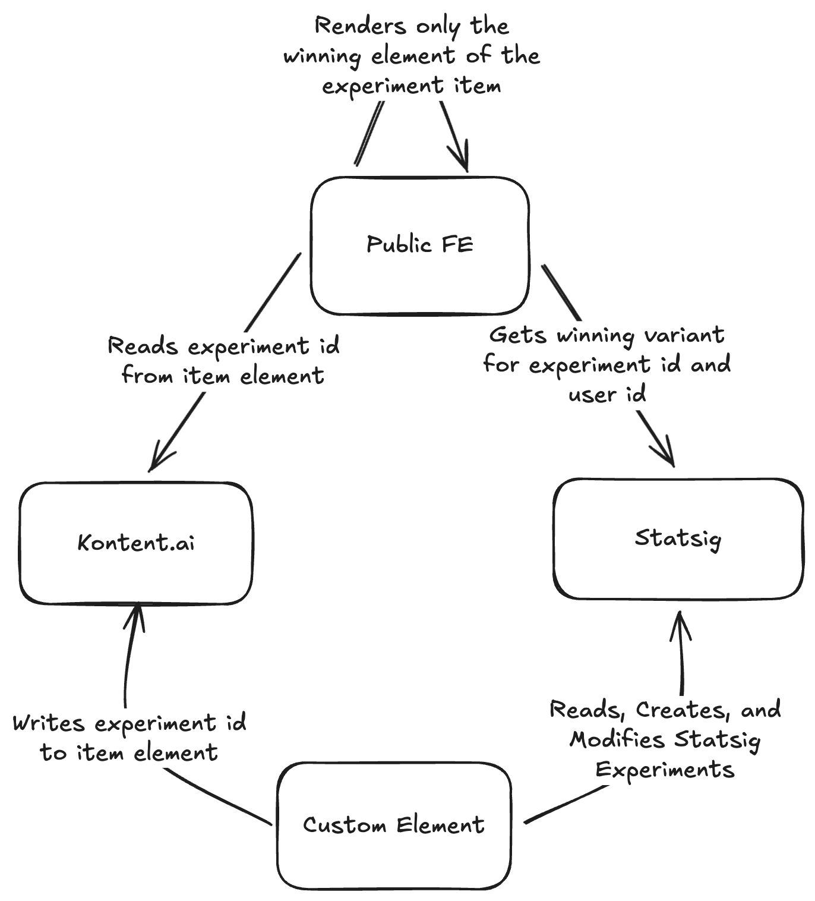

# Statsig A/B Testing Custom Element for Kontent.ai

[](https://app.netlify.com/start/deploy?repository=https://github.com/JiriLojda/statsig-custom-element-kontent-ai)

A [Custom Element](https://kontent.ai/learn/docs/custom-elements) for easy A/B testing with Kontent.ai and [Statsig](https://statsig.com/).



## How the Integration Works

### 1. Content Modeling in Kontent.ai

Create an **Experiment** content type with three elements:

| Element | Type | Purpose |
|---------|------|---------|
| `statsig_a_b_testing` | Custom element (this one) | Stores the Statsig experiment ID |
| `control` | Linked items | Content shown to users in the control group |
| `test` | Linked items | Content shown to users in the test group |

> [!NOTE]
> You can create this content type manually or use the sync command to create it automatically (see [Syncing the Experiment Content Type](#syncing-the-experiment-content-type)).

### 2. Statsig Experiment Setup

The Statsig experiment must have exactly **two variants**, each with a parameter named `variant`:
- First variant: `variant` = `control`
- Second variant: `variant` = `test`

> [!NOTE]
> When you create an experiment through this custom element, it automatically configures this for you with a 50/50 split.

### 3. Connecting Content to Experiments

Use the custom element to either:
- **Create a new experiment** in Statsig directly from Kontent.ai
- **Link an existing experiment** from your Statsig project

The custom element stores the experiment ID in its value (as JSON: `{ "experimentId": "..." }`), creating the connection between your content item and the Statsig experiment.

### 4. Frontend Resolution

When your frontend app renders content containing an experiment:

1. Read the experiment ID from the custom element's value
2. Call Statsig SDK with the experiment ID and current user ID
3. Statsig returns the winning variant (`control` or `test`) based on user assignment
4. Render only the linked items from the winning variant, ignore the other

> [!TIP]
> **Terminology note**: The term "winning variant" refers to the variant assigned to the current user during an active experiment. Statsig deterministically assigns each user to a variant based on their user ID, ensuring they always see the same experience. This is different from Kontent.ai language variants - here "variant" refers to the experiment groups (control/test).

See the [`example-client/`](./example-client/) folder for a minimal frontend implementation showing how to resolve experiment variants using the Statsig SDK.
The example shows both, how to resolve experiments as components in rich text and as linked items in a linked items element.

### 5. Concluding Experiments

When you're ready to conclude an experiment and declare a winner:

1. Click the **Conclude** button in the custom element (only available for active experiments)
2. Select the winning variant (control or test)
3. Confirm the cleanup action

The cleanup process will:
- Mark the experiment as concluded in Statsig with the selected winner
- Find all content items that reference this experiment item
- Replace the experiment references with the winning variant's linked items
- Delete the experiment item from Kontent.ai

**Note:** The conclude functionality requires additional API keys to be configured (see [Environment Variables](#environment-variables)).

## Prerequisites

Before running this custom element, you need:

1. **Statsig Account** - Sign up at [statsig.com](https://statsig.com/)
2. **Statsig Console API Key** - Generate one from Statsig Console → Project Settings → API Keys → Console API Key (only accessed in Netlify Functions for security)
3. **Netlify Account** (for deployment) - The element uses Netlify Functions as a backend proxy to securely call the Statsig API

## Configuration

### Environment Variables

Set the following environment variables in your Netlify deployment:

| Variable | Required | Description |
|----------|----------|-------------|
| `STATSIG_CONSOLE_KEY` | Yes | Your Statsig Console API Key |
| `KONTENT_MANAGEMENT_API_KEY` | For cleanup | Kontent.ai Management API key for modifying content |
| `KONTENT_PREVIEW_API_KEY` | For cleanup | Kontent.ai Preview Delivery API key for finding item usages |

The Management and Preview API keys are only required if you want to use the **Conclude Experiment** functionality. Without them, you can still create and link experiments, but the cleanup feature will be disabled.

For local development, create a `.env` file in the project root (copy from `.env.example`):

```
STATSIG_CONSOLE_KEY=console-xxxxxxxxxxxxx
KONTENT_MANAGEMENT_API_KEY=your-management-api-key
KONTENT_PREVIEW_API_KEY=your-preview-api-key
```

## Getting Started

### Installation

```bash
pnpm i
```

### Local Development

```bash
pnpm dev
```

This starts Netlify Dev which runs both the Vite development server and the Netlify Functions locally.

## Deployment

1. Deploy to Netlify (connect your repository or use `netlify deploy`)
1. Set the `STATSIG_CONSOLE_KEY` environment variable in Netlify site settings
1. Use the deployed URL as the custom element's hosted code URL in Kontent.ai

## Syncing the Experiment Content Type

Instead of manually creating the Experiment content type, you can automatically sync it to your Kontent.ai project using the included sync script.

### Prerequisites

1. Your Kontent.ai environment ID
2. A Management API key with permissions to modify content types
3. The deployed HTTPS URL of your custom element

### Configuration

Set the following environment variables in your `.env` file (copy from `.env.example` `cp .env.example .env`):

| Variable | Required | Description |
|----------|----------|-------------|
| `KONTENT_ENVIRONMENT_ID` | Yes | Target Kontent.ai environment ID |
| `KONTENT_MANAGEMENT_API_KEY` | Yes | Management API key |
| `CUSTOM_ELEMENT_URL` | Yes | HTTPS URL where the custom element is deployed |
| `CONTENT_TYPE_CODENAME` | No | Custom codename (default: `statsig_experiment`) |

### Usage

```bash
pnpm sync:content-type
```

This creates a content type with:
- **Statsig A/B Testing** (`statsig_a_b_testing`) - Custom element pointing to your deployed URL
- **Control** (`control`) - Linked items for the control variant
- **Test** (`test`) - Linked items for the test variant

If a content type with the same codename already exists, it will be updated to match the expected structure.

## License

Distributed under the MIT License. See [`LICENSE.md`](./LICENSE.md) for more information.
